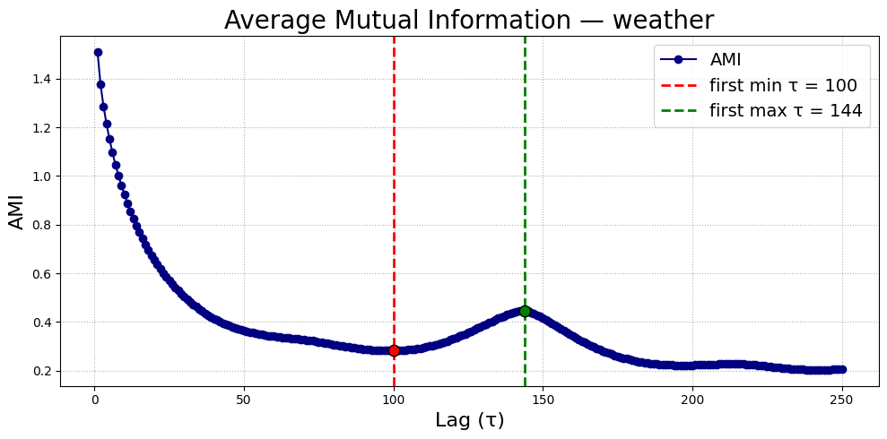
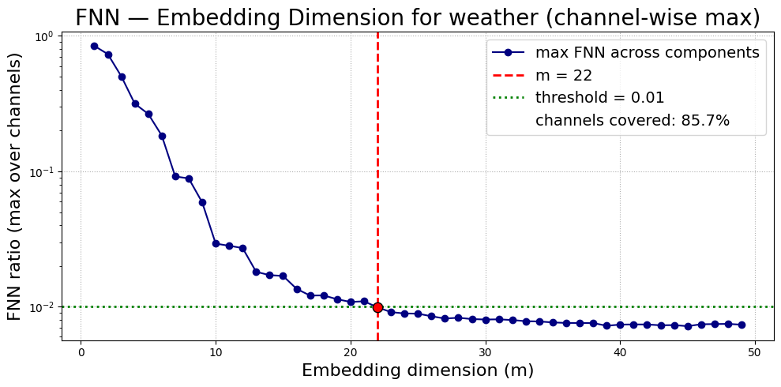
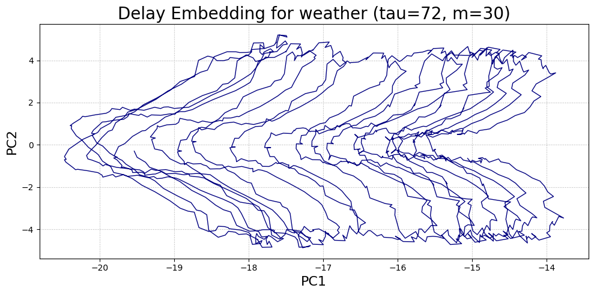

# PatchTST и Takens’ embedding theorem: как выбрать правильное представление временного ряда

## Введение
В задаче **прогнозирования многомерных временных рядов** (multivariate time series forecasting) одним из ключевых факторов является выбор **оптимального представления данных**.

От того, как временной ряд преобразуется во входное пространство модели, зависит способность модели понимать скрытую динамику и делать точные предсказания. Другими словами, задача прогноза сводится к **подбору оптимальных гиперпараметров**.

В этой работе используется архитектура **PatchTST**, а её связь с **теоремой Такенса о вложении** позволяет формально обосновать выбор гиперпараметров и построить систематический метод их подбора.

## PatchTST
**PatchTST (Time Series Transformer with Patching)** – архитектура для прогнозирования временных рядов, основанная на трансформерах, [предложенная](https://arxiv.org/abs/2211.14730) на ICLR 2023.

Принцип работы:
- многомерный временной ряд $X(t) \in \mathbb{R}^d$ разбивается поканально на непересекающиеся сегменты фиксированной длины (**патчи**);
- каждый патч рассматривается как элемент (**токен**) последовательности (аналог слова в NLP);
- последовательность токенов подаётся в **Transformer encoder**, который учится моделировать их взаимные зависимости;
- модель формирует прогноз **сразу для всех каналов ряда**.

Гиперпараметры PatchTST:
- **длина патча** (`patch_len`) – сколько точек входит в один токен;
- **шаг окна** (`stride`) – как часто берутся патчи из исходного ряда;
- **горизонт наблюдения** (`seq_len`) – фактически количество патчей, которые получает модель на вход;
- архитектурные параметры трансформера (число слоёв, attention heads, размер скрытого пространства).

Таким образом, PatchTST строит представление временного ряда не на уровне отдельных точек, а на уровне **осмысленных сегментов**. От выбора длины патча, шага окна и горизонта наблюдения зависит, какие зависимости модель научится улавливать.

## Takens’ embedding theorem
**Takens’ embedding theorem** утверждает: динамическую систему можно восстановить по наблюдениям $y(t) \in \mathbb{R}^d$ с помощью **delay embedding**:

$$
Y(t) = \big( y(t),\; y(t-\tau),\; y(t-2\tau),\; ...,\; y(t-(m-1)\tau) \big) \in \mathbb{R}^{d \cdot m},
$$

где:
- $\tau$ – задержка (delay);
- $m$ – размер вложения (dimension).

**Delay embeddings** позволяют восстановить скрытую динамику системы, что даёт возможность прогнозировать временной ряд, используя знание о восстановленной динамической системе.

## PatchTST как реализация Takens’ embedding theorem
Построение входной последовательности в PatchTST можно рассматривать как **частный случай** delay embedding:
$$patch(t), patch(t - \text{stride}), patch(t - 2 \cdot \text{stride}), ..., patch(t - (n_{tokens} - 1) \cdot \text{stride})$$

Фактически строится delay embedding, где:
- шаг окна $\text{stride} = \tau$
- число токенов $n_{tokens} = m$

Однако стоит отметить, что в PatchTST входная последовательность строится **поканально**, а также используется **поканальная независимость**, поэтому:
- в теории будет правильней считать параметры delay embedding для каждого канала отдельно, и затем агрегировать полученные параметры, чем считать параметры delay embedding для целого ряда.
- в работе же мы будем делать анализ как и по каждому каналу отдельно, так и всей последовательности в целом

Таким образом:
1. PatchTST формирует фазовое вложение временного ряда в высокоразмерное пространство.
2. Transformer учится восстанавливать динамику системы.  
3. Обученная модель используется для прогнозирования ряда на разных горизонтах.

## Используемые алгоритмы для подбора гиперпараметров PatchTST
1. **Average Mutual Information (AMI)** – для выбора задержки $\tau$  
   - Оптимальный лаг соответствует первому локальному минимуму AMI: значения $y(t)$ и $y(t-\tau)$ должны быть связаны, но не избыточны
   - Для многомерных рядов AMI усредняется по каналам.  
   - Выбор:  
     - `stride` = первый широкий минимум AMI,  
     - `patch_len` = первый широкий минимум AMI, либо первый широкий максимум AMI.  

2. **False Nearest Neighbors (FNN)** – для выбора размерности $m$  
   - При малом $m$ траектории пересекаются, и ложных соседей много.  
   - Оптимальное $m$ – минимальное, при котором доля соседей падает ниже порога.  
   - Для многомерных рядов берётся максимум $m$ по каналам.  
   - Выбор:  
     - $n_{\text{tokens}} =$ найденное $m$,  
     - `seq_len` $= (n_{\text{tokens}} - 1) \cdot$ `stride` + `patch_len`.  

## Выбор параметров delay embedding
Для построения **delay embedding** необходимо корректно выбрать параметры $\tau$ и $m$.  

В директории [`data_analysis`](./PatchTST_supervised/data_analysis) реализованы инструменты для их подбора:

- **estimators.py**  
  - класс `DelayEstimator` – выбор оптимальной задержки $\tau$ с помощью **(AMI)**;  
  - класс `EmbeddingDimensionEstimator` – оценка оптимальной размерности $m$ с помощью **(FNN)**.  

- **delay_embedding.py**  
  - функции для построения delay embedding;  
  - средства визуализации фазовых портретов.  

- **Jupyter-ноутбуки**  
  - графики усреднённого AMI по всем каналам и вычисление $\tau$;  
  - анализ FNN и выбор $m$;  
  - визуализация восстановленного фазового пространства для различных комбинаций $(\tau, m)$.

## Результаты

### Подбор embedding-параметров на примере *weather*
- **График AMI**:  
  

- **График FNN**:  
  

- **Визуализация восстановленного фазового пространства**:
  

### Таблица с подобранными параметрами
| Dataset  | τ (эв.) | m (эв.) | τ (виз.) | m (виз.) |
|----------|---------|---------|----------|----------|
| Weather  | 100     | 22      | 72       | 30       |
| ETTh1    | 14      | 29      | 12       | 40       |
| ETTh2    | 14      | 30      | 12       | 30       |
| ETTm1    | 57      | 32      | 48       | 30       |
| ETTm2    | 55      | 57      | 48       | 40       |
